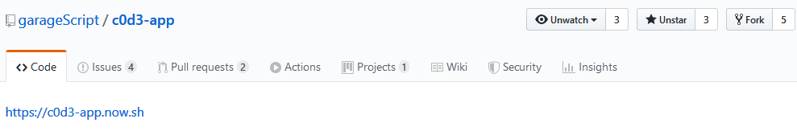

# Welcome to Development Setup!

If you are reading this you are ready to contribute to c0d3.com!

To begin we will need to set up the code base on your own machine. To do this we will be creating a copy of the **c0d3** [GitHub repository](https://github.com/garageScript/c0d3-app).

## Prerequisites

- [Yarn](https://classic.yarnpkg.com/en/)
- [Node](https://nodejs.org/en/)
- [Postgresql](https://www.postgresql.org/download/)
- [Docker](https://docs.docker.com/get-docker/)
- [Docker-compose](https://docs.docker.com/compose/install/)

## Installation



1. Click on the button in the top right corner with the text `Fork` to create a copy of this repository:

   

   **Notice** in the top left corner of the screenshot above that it states that the repository was forked from garageScript/c0d3-app

2. Click on the "Clone or download" green button and copy the `ssh` or `https` url.

3. Navigate to your terminal and clone: `git clone url-goes-here`.

4. After cloning, you will want to change the current directory to the `c0d3-app` folder that was created.

5. `yarn install` to install all of the dependencies needed to run the app.

6. Configure your local environment. Create a .env file in your c0d3-app directory with the following variables. Port numbers are completely arbitrary, as long as docker-compose.yml is consistent with this .env file you're good.
 **Do not commit MAILGUN_API_KEY or share it outside c0d3.**
```
   MAILGUN_API_KEY=123abc #ask for valid key in chat
   MATTERMOST_ACCESS_TOKEN=123abc #you will generate it yourself
   CHAT_URL=http://localhost:8080/api/v4 #see instructions below for mattermost docker image
   CLIENT_URL=http://localhost:4000 #used in registration email
   #postgres user, database name, password, host and port
   DB_USER=c0d3_admin
   DB_NAME=c0d3
   DB_PW=admin
   DB_HOST=localhost
   DB_PORT=7000
```
6. Build docker images. Go to docker directory and type `docker-compose build`. It will take some time for docker to pull and install everything. In the end you will have one container for the main c0d3 app (postgres), and three containers for mattermost server (db,app, web). Mattermost is not required for our main app to function unless you want to register new users or work specifically on chat features. To start postgres only you can use `docker-compose start postgres` (don't do this yet).

7. Prepare volume directories. Volumes are mappings from containers to your local machine.
```
mkdir -pv ./volumes/app/mattermost/{data,logs,config,plugins,client-plugins}
sudo chown -R 2000:2000 ./volumes/app/mattermost/
```
8. Now you can start docker `docker-compose up` (add -d flag to start in detached mode). To stop all containers `docker-compose down`.

9. Start c0d3 app `PORT=4000 yarn dev`. If everything went right you will see the landing page. Login with `admin:password`.

10. Configure your local mattermost server. When you open [http://localhost:8080](http://localhost:8080), you will be greeted with the mattermost login page. Enter any email (this setup won't have an SMTP server, so no actual mails will be sent). First user automatically becomes the server admin. Create new team and enable use of personal access tokens *System Console > Integrations > Custom Integrations*.

11. Generate a personal access token. Close system console, go to team chat (town square) and click on three horizontal bars near your name *Account settings > Security* , then `generate personal access token`. This value will be used as MATTERMOST_ACCESS_TOKEN.

12. Keep in mind that by default mattermost requires very secure passwords: at least 10 characters, at least one uppercase letter, one number and one special symbol. Either use such password when you need to register new users or edit mattermost config at *docker/docker/volumes/app/mattermost/config/config.json* PasswordSettings. 


To submit challenges:
1. Logout `c0d3 logout`.
2. Login to your local server `c0d3 login --url http://localhost:4000/api/graphql`.
3. Submit your code `c0d3 submit --url http://localhost:4000/api/graphql`
It should be visible on your local setup.

To open terminal inside container:
1. Check your current active docker containers `docker ps`. There should be four of them - web, db and app, postgres.
2. Open bash console inside postgres container `docker exec -it * postgres id* /bin/bash`.
3. You can connect to postgres `psql -U *username* -d *dbname*`. If you have psql installed you can do it the easier way `psql -U c0d3_admin -h localhost -p 7000 -d c0d3`

If you want to pass further lessons as admin you need to manually edit database (since no one can review your submissions). Connect to postgres container (see above) and type:
```
INSERT INTO "userLessons"("isPassed", "lessonId", "userId", "createdAt", "updatedAt") VALUES('true', 5, 5,'2020-12-29 18:16:48.56+03','2020-12-29 18:16:48.56+03');
```
The important values here are your userID(5) and lessonID (check lessons table `TABLE lessons;`).


### Known problems

Snapshots are failing with:

`
    - colSpan={5} +   colSpan={4}     `                                                    
`
                      - href="#"                                                             +             href="/#" 
                      `
Or `yarn autofix` is failing with `Component definition is missing display name` in `containers/withQueryLoader.tsx` error.

You most likely installed a new module by using npm instead of yarn. While in theory these tools should be interchangeable, in practice it can result in such weird errors. Recloning git repo should help.  
  

### You are now all setup on your machine! Keep up the great work and thank you for your contributions 
👍